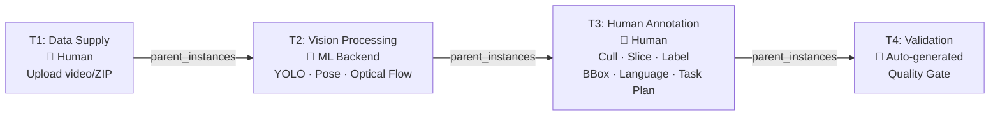

# Humanbased Contributor Portal

The supply-side web portal for the **Humanbased** data contribution platform. Contributors browse campaigns, upload raw data, receive AI-powered pre-processing, and annotate outputs using the **Embodiment-X** annotation schema. Every contribution is tracked as an atomic instance with full provenance lineage.

**Live repo:** [`codatta/contributor-portal`](https://github.com/codatta/contributor-portal)
**Sibling:** [`codatta/developer-portal`](https://github.com/codatta/developer-portal) (demand-side)

---

## What's Implemented

### Auth + API Foundation ([PR #2](https://github.com/codatta/contributor-portal/pull/2))

| Area | What shipped |
|---|---|
| **Supabase Auth** | SSR browser + server clients, `useUser` reactive hook, OAuth callback route handler |
| **Sign-in / Sign-up** | Email OTP 3-step flow (email → verify → profile), Google + GitHub OAuth buttons |
| **Session management** | Top bar reads user session, avatar dropdown with sign-out |
| **API routes** | FastAPI scaffold: contributions, contributors, enrollments, tasks (in-memory store, wired to Supabase in I0-4) |

### Contribution Pipeline Workspace ([PR #3](https://github.com/codatta/contributor-portal/pull/3))

Full 4-step annotation workspace re-implemented natively (architecture decision: native over iframe embed of `labeling.codatta.io`).

| Step | Route | What it does |
|---|---|---|
| **Supply** (T1) | `/workspace/[id]/[task]/supply` | Drag-and-drop file upload, 4 detection preset cards (Universal, YOLO Human Filter, Workstation, Workstation+Pose) + Advanced parameter toggle, task metadata form |
| **Cull Review** (T3a) | `/workspace/[id]/[task]/review` | Konva FramePlayer with person bbox + arm keypoint overlays, segment info panel (frames, duration, motion score, blur), keyboard-driven review (`Y` keep / `N` cull / `← →` navigate), color-coded segment timeline |
| **Slice & Annotate** (T3b) | `/workspace/[id]/[task]/annotate` | Draft segments list, filmstrip scrubber, action label palette with `1–5` keyboard shortcuts (`fold_box`, `fold_textile`, `packing`, `pick_place`, `other_valid`), language instruction textarea, task plan editor |
| **Export** (T3c) | `/workspace/[id]/[task]/export` | Completion checklist, label distribution bars, instance fingerprint preview (content_hash, schema version, parent instances), gated submit button |

**Workspace chrome** (shared layout across all steps):
- Pipeline progress bar (T1 → T2 → T3 → T4 stages, step-aware highlighting)
- Sub-task navigation bar (Supply → Cull Review → Slice & Annotate → Export, clickable)
- Action bar with task timer, Save Draft, Skip, Prev, and step-specific primary CTA

**Confirmation dialog system:**
- `WorkspaceNavProvider` tracks dirty state per step (isDirty + isDraftCacheable)
- Two variants: green "Your draft will be cached remotely" (review/annotate) and amber "Your work cannot be saved yet" (supply)
- Guards all navigation: step bar clicks, Prev/Next, Skip, instance switching

**Instance switcher:**
- Drawer opens from "Instance #xxx" in top-right of workspace
- "This campaign" / "All enrolled" tabs showing task cards
- Click any card → triggers confirmation dialog if current work is unsaved

**Task routing:**
- Supply task cards → `/supply` step
- Labeling task cards → `/review` step (first human step after VE pre-labeling)
- Validation cards → `/review` step

### Shell & Navigation

| Screen | Status | Key features |
|---|---|---|
| **My Tasks** | Implemented (mock data) | Today's summary strip, priority pills (Resume / Expiring / In Dispute) with expandable carousel, sticky campaign tab bar with truncate-on-hover, 3-column task card grid, timeline layout |
| **Campaign Detail** | Implemented (mock data) | Banner, community stats, task type breakdown, pipeline DAG, compensation, qualifications gate, Enroll CTA |
| **Dashboard** | Implemented (mock data) | Metrics cards, alerts, quick actions |
| **Sidebar** | Implemented | Collapsible, sections: Work (Tasks, Discover, Enrollments, Contributions), Earnings, Settings, Docs |
| **Top Bar** | Implemented | Sandbox/Production toggle, user avatar dropdown |
| **Profile** | Implemented (mock data) | Hero section, credentials, activity log |

### Demo Content

10 real-world company profiles and 10 aligned annotation campaigns in `design/demo/`:

| Tier | Companies |
|---|---|
| **Big Tech** | NVIDIA PhysicalAI, Google DeepMind, Alibaba DAMO Academy, Meta FAIR |
| **Emerging** | Physical Intelligence (PI), Figure AI, ElevenLabs, Mistral AI |
| **Small / Academic** | Stanford IRIS Lab, 1X Technologies |

Each company has a logo (PNG from GitHub/HuggingFace) and `profile.json`. Each campaign has a JSON definition with task pipeline, action vocabulary, and compensation model. All four compensation types represented (fixed, royalty, hybrid, bounty) across 5 frontiers (Robotics, Vision+Language, Speech, Language, Embodied AI).

### Foundation (committed in initial scaffold)

| Item | Status |
|---|---|
| Project scaffold (Next.js 16 + FastAPI + shared types) | Done |
| Domain types + database migration (`001_contribution_schema.sql`) | Written, not yet applied |
| Campaign template (`robotics_video_collection` YAML + 4 LS XML configs) | Done |
| Template loader service (YAML + XML parsing) | Done |

### Not Yet Implemented

| Item | Blocker | Linear ticket |
|---|---|---|
| Deploy to Vercel + Cloud Run | PRs need merge | IN-68 |
| Apply DB migration to Supabase | Manual step | IN-69 |
| ML Backend Adapter (Vision Engine wrapper) | GPU server access confirmation | IN-71 |
| Seed data service (real campaigns in DB) | Needs IN-69 | IN-73 |
| End-to-end demo with real data | Needs IN-69 + IN-71 | IN-72 |

---

## System Architecture

```mermaid
graph TB
    subgraph Shared Infrastructure
        DB[(Supabase PostgreSQL<br/>uxafdddzhgdhsabkwmgw)]
        Storage[Supabase Storage<br/>Video / Image / Frames]
        Auth[Supabase Auth]
    end

    subgraph Developer Portal
        DP_Web[Webapp<br/>React + Bun]
        DP_API[API<br/>FastAPI]
        DP_Web --> DP_API
        DP_API -->|reads & writes<br/>campaigns, orgs,<br/>subscriptions, billing| DB
    end

    subgraph Contributor Portal
        CP_Web[Webapp<br/>Next.js 16]
        CP_API[API<br/>FastAPI]
        CP_Web --> CP_API
        CP_API -->|reads campaigns<br/>writes instances,<br/>annotations, lineage| DB
        CP_API --> Storage
    end

    subgraph Agent Layer — ML Backend Protocol
        Adapter[ML Backend Adapter<br/>POST /predict · /setup · /health]
        VE[Vision Engine<br/>YOLO v8 · Pose · Optical Flow<br/>GPU Server]
        Adapter --> VE
    end

    %% Cross-system connections
    CP_API -->|LS /predict| Adapter
    DP_API -->|writes campaign config<br/>LS XML + task DAG| DB
    Auth --> CP_Web

    classDef shared fill:#1a1a2e,stroke:#e94560,color:#fff
    classDef portal fill:#16213e,stroke:#0f3460,color:#fff
    classDef agent fill:#0f3460,stroke:#53a8b6,color:#fff

    class DB,Storage,Auth shared
    class DP_Web,DP_API,CP_Web,CP_API portal
    class Adapter,VE agent
```

---

## Shared Infrastructure — Authorship Boundary

> **Status: Proposed — NOT yet adopted.** The ownership matrix below describes the agreed *target state*, not current runtime behaviour. Postgres per-portal service roles, the DB-client allowlist wrapper, and the `shared_` migration-prefix CI guard are all unbuilt. Rollout is tracked as `I0-3` in [`prd.md`](./prd.md) → Build Queue and blocks `I0-4` (migration application). Do not rely on this section for safety guarantees yet — treat it as the design contract that future work will enforce.

Both portals share the same Supabase projects (staging + production). In the end state, every table has a **single owning portal**, with runtime Postgres grants enforcing the boundary — cross-portal writes would fail at the DB layer rather than the application layer.

| Table group | Examples | DDL owner | Runtime writes |
|---|---|---|---|
| **Shared-contract (config)** | `campaigns`, `tasks` | Developer portal | Developer portal only (contributor read-only) |
| **Contributor-owned (execution)** | `task_instances`, `enrollments`, `contributions`, `lineage_records`, `contributors`, `credentials` | Contributor portal | Contributor portal only (developer read-only) |
| **Developer-owned (others)** | `organizations`, `accounts`, `api_keys`, `subscriptions`, `deliveries`, `charges`, `users`, … | Developer portal | Developer portal only (contributor has no access) |

**Phased DDL exception (V1 only).** While the V1 schema is in flux, the contributor portal may author migrations against `campaigns` / `tasks` without a repo context-switch. Such migrations must use filename prefix `shared_` and link to a notify-PR in the developer-portal repo. Runtime grants remain strict throughout — this exception affects only who writes the SQL, not who writes rows at runtime.

**Long-term convergence.** The phased exception auto-expires when `I4-1` ships. Post-V1, the contributor portal stops authoring DDL against shared-contract tables entirely — change requests go through the developer-portal repo. Both environments converge to a single steady state: one repo holds the pen per table, runtime grants are the enforcement floor forever.

See [`prd.md` → Infrastructure Architecture → Database Strategy](./prd.md) for the full grant matrix, ASCII diagrams (V1 Staging / V1 Production / Post-V1 convergence), promotion protocol, and joint-adoption rules.

---

## Campaign Pipeline

The V1 campaign is **robotics video collection** using the Embodiment-X annotation schema:



Each task has a **Label Studio XML config** defining its annotation UI. Each transition creates a new `task_instance` with `parent_instances[]` linking to the upstream instance.

---

## Quick Start

```bash
# Frontend
cd packages/webapp && bun install && bun dev     # http://localhost:3000

# Backend
cd packages/api && uv sync && uv run uvicorn app.main:app --reload  # http://localhost:8000

# Seed a campaign
curl -X POST http://localhost:8000/v1/campaigns/seed

# Run Playwright tests (with dev server running)
cd packages/webapp && bun x playwright test e2e/contribution-pipeline-journey.spec.ts
```

### Key URLs (local dev)

| URL | What you see |
|---|---|
| `/contribute/tasks` | Task queue — click any card to enter the workspace |
| `/contribute/campaigns/camp-k1m` | Kitchen Manipulation campaign detail + Enroll |
| `/workspace/camp-k1m/t1-supply-55/supply` | Supply step — upload + detection presets |
| `/workspace/camp-k1m/t3-label-48/review` | Cull review — FramePlayer + keyboard Y/N |
| `/workspace/camp-k1m/t3-label-48/annotate` | Slice & annotate — labels + language |
| `/workspace/camp-k1m/t3-label-48/export` | Export — checklist + submit |

---

## Repository Structure

```
contributor-portal/
├── README.md
├── CLAUDE.md                 # AI coding instructions + architecture decisions
├── prd.md                    # Product requirements + build queue
├── design/
│   ├── overview.md           # Phase roadmap, user journeys, screen inventory
│   ├── system.md             # Design system tokens, component patterns
│   ├── screens/              # Per-screen specs
│   └── demo/                 # Real-world company profiles + campaign definitions
│       ├── companies/        #   10 companies (logo.png + profile.json each)
│       ├── campaigns/        #   10 campaign JSON definitions
│       └── README.md         #   Index + usage guide
├── packages/
│   ├── webapp/               # Next.js 16 App Router
│   │   ├── src/
│   │   │   ├── app/
│   │   │   │   ├── auth/             # Sign-in, sign-up, OAuth callback
│   │   │   │   ├── contribute/       # Dashboard, tasks, campaigns, enrollments, etc.
│   │   │   │   └── workspace/        # 4-step contribution pipeline
│   │   │   │       └── [campaignId]/[taskId]/
│   │   │   │           ├── layout.tsx    # Shared chrome (pipeline bar, step nav, action bar)
│   │   │   │           ├── supply/       # T1: upload + detection presets
│   │   │   │           ├── review/       # T3a: cull review + FramePlayer
│   │   │   │           ├── annotate/     # T3b: slice + label + language + task plan
│   │   │   │           └── export/       # T3c: checklist + submit
│   │   │   ├── components/
│   │   │   │   ├── workspace/        # FramePlayer, SegmentTimeline, FilmstripScrubber,
│   │   │   │   │                     # NavContext, ConfirmNavDialog, InstanceSwitcher
│   │   │   │   ├── auth/             # OAuth buttons, OTP input, password input
│   │   │   │   ├── shell/            # Sidebar, TopBar, NavItem
│   │   │   │   └── ui/              # shadcn/ui
│   │   │   ├── lib/
│   │   │   │   ├── mock/            # Supabase-shaped mock data (workspace + task instances)
│   │   │   │   ├── supabase/        # SSR browser + server clients
│   │   │   │   └── config.ts        # BRAND + THEME constants
│   │   │   └── hooks/               # useUser
│   │   ├── e2e/                     # Playwright specs
│   │   └── tests/v1/ux-tests/      # 17 pipeline journey screenshots
│   ├── api/                  # Python FastAPI backend
│   │   ├── app/
│   │   │   ├── routes/       # campaigns, contributions, contributors, enrollments, tasks
│   │   │   ├── models/       # Pydantic domain models
│   │   │   └── services/     # Template loader
│   │   └── pyproject.toml
│   └── shared/               # TypeScript domain types
├── templates/                # Campaign templates (YAML DAG + LS XML configs)
│   └── robotics_video_collection/
├── sql-query/
│   └── migrations/           # Supabase SQL (additive, non-breaking)
└── .env.example
```

---

## Configuration

### Environment Variables

```bash
# Supabase (shared instance with developer-portal)
NEXT_PUBLIC_SUPABASE_URL=https://uxafdddzhgdhsabkwmgw.supabase.co
NEXT_PUBLIC_SUPABASE_ANON_KEY=...

# Backend API
API_URL=http://localhost:8000

# Vision Engine (external GPU server, consumed via ML Backend adapter)
VISION_ENGINE_URL=http://47.84.74.124:8001

# Storage
STORAGE_BUCKET=contribution-uploads
```

### Deployment

| Component | Target | Status |
|---|---|---|
| **Webapp** | Vercel | Not yet deployed (IN-68) |
| **API** | Google Cloud Run | Not yet deployed (IN-68) |
| **ML Backend Adapter** | Cloud Run | Not yet built (IN-71) |
| **Vision Engine** | GPU server (existing) | External, unchanged |
| **Database** | Supabase (managed) | Migration written, not yet applied (IN-69) |

---

## Tech Stack

| Layer | Technology |
|---|---|
| Frontend | Next.js 16 (App Router) · React 19 · Tailwind CSS v4 · shadcn/ui · Konva |
| Backend | Python 3.13+ · FastAPI · uv · httpx |
| Database | PostgreSQL (Supabase, shared instance) |
| Storage | Supabase Storage (S3-compatible) |
| Auth | Supabase Auth (email OTP + Google + GitHub OAuth) |
| ML Backend | Label Studio ML Backend protocol (`/predict`, `/setup`, `/health`) |
| Vision Processing | YOLO v8 · Pose Estimation · Optical Flow (external GPU) |
| Testing | Playwright (e2e screenshots) |
| Package Managers | bun (frontend) · uv (backend) |

---

## Related Documentation

| Document | Location | What it covers |
|---|---|---|
| Architecture decisions | [`CLAUDE.md`](./CLAUDE.md) | LS XML config, ML Backend protocol, shared Supabase, native vs iframe, per-step routing |
| Build queue | [`prd.md`](./prd.md) | Sprint items with acceptance criteria, iteration strategy |
| Design overview | [`design/overview.md`](./design/overview.md) | Phase roadmap, user journeys, screen inventory |
| Design system | [`design/system.md`](./design/system.md) | Color tokens, component patterns, typography |
| Demo content | [`design/demo/README.md`](./design/demo/README.md) | 10 company profiles + 10 campaign definitions |
| Developer Portal | [`codatta/developer-portal`](https://github.com/codatta/developer-portal) | Demand-side: campaign config, billing, subscriptions |
