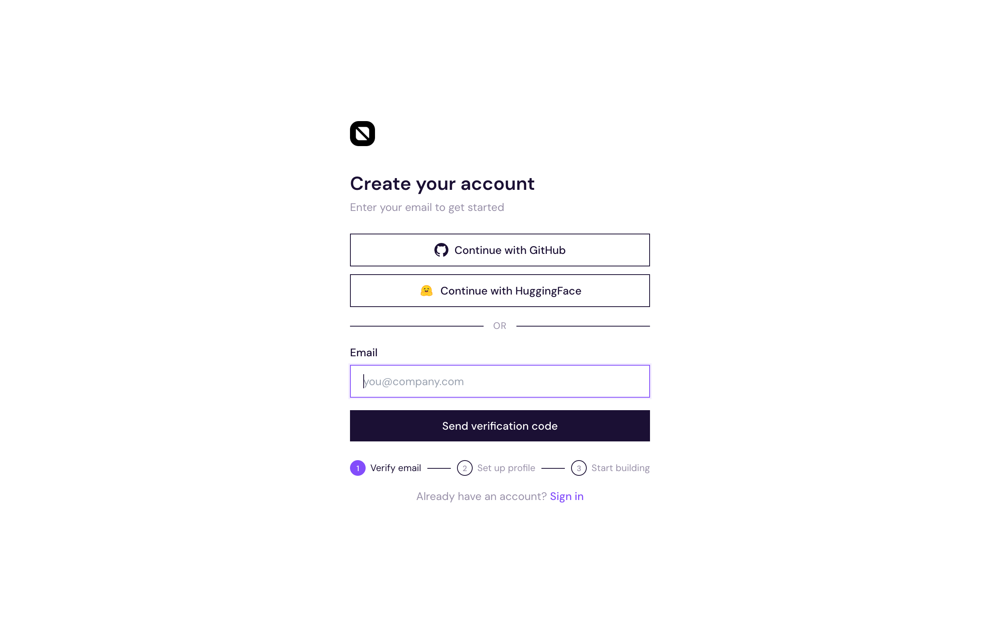

## Project Overview

This is the **developer.humanbased.ai** monorepo — the developer portal for Humanbased data consumers. It contains:

- `packages/webapp/` — Frontend (React + Tailwind via Bun HTML imports)
- `packages/api/` — Backend API (**Python** — FastAPI + uvicorn)
- `packages/cli/` — CLI tool (@humanbased/cli)
- `packages/mcp/` — MCP server
- `packages/docs/` — Documentation site
- `shared/` — Shared TypeScript types, utils, constants (frontend only)

Each package can have its own deployment config. See `prd.md` for full scope and build queue.

**Design system:** See `DESIGN_SYSTEM.md` (repo root) for color tokens, typography, spacing, component patterns, and UI conventions. All frontend work must follow it.

## Deployment Policy

**Two environments: staging (`staging` branch) and production (`main` branch).**

### Production (stable — end users)

| Package | Domain | Trigger |
|---------|--------|---------|
| `packages/webapp/` | developer.humanbased.ai (Vercel) | Push to `main` |
| `packages/api/` | api.humanbased.ai (Cloud Run: `humanbased-api`) | Push to `main` |
| `packages/docs/` | docs.humanbased.ai (Vercel) | Push to `main` |

### Staging (active development — internal team)

| Package | Domain | Trigger |
|---------|--------|---------|
| `packages/webapp/` | staging.developer.humanbased.ai (Vercel alias) | Push to `staging` |
| `packages/api/` | staging.api.humanbased.ai (Cloud Run: `humanbased-api-staging`) | Push to `staging` |
| `packages/docs/` | staging.docs.humanbased.ai (Vercel alias) | Push to `staging` |

Never deploy a feature branch directly to production. Feature branches target `staging`, not `main`. Production releases happen via PR from `staging` → `main`.

**API is Cloud Run only.** All API traffic routes through `api.humanbased.ai` → Google Cloud Run. Do not create or deploy Vercel projects for the API package.

**All Vercel deployments MUST use the `inductive-network` team (Pro account).** Never deploy to personal accounts, `yi-zhangs-projects-1c882fd0` (Motivation Labs), or any other team. All `vercel` CLI commands in workflows and manual deploys must include `--scope=inductive-network`. The active Vercel projects are:

| Project | Team | Domain |
|---------|------|--------|
| `webapp` | `inductive-network` | `developer.humanbased.ai` / `staging.developer.humanbased.ai` |
| `docs` | `inductive-network` | `docs.humanbased.ai` / `staging.docs.humanbased.ai` |

No other Vercel projects should exist for this repo. If you see deployments on other teams/projects, shut them down.

**Full deployment guide:** See `docs/deployment.md` for infrastructure details, staging setup, manual deploy steps, VPS proxy setup, AliCloud PolarDB whitelist config, and troubleshooting.

## Branch & PR Policy

**`main` and `staging` are protected — NEVER commit directly to them. NEVER merge without a PR. No exceptions.**

### Branch model

```
feat/* ──► PR to staging ──► staging (auto-deploy)
                                ↓
                         manual QA / sign-off
                                ↓
              PR: staging → main ──► production (auto-deploy)
```

- **`staging`** — integration branch for active development. Deploys to staging. CI is permissive (does not require all checks to pass).
- **`main`** — stable production branch. Deploys to prod. Full quality gate required.
- **`release/**`** — hotfix branches that deploy directly to prod.

All feature work happens on a branch:

```
feat/<short-description>    # new capability
fix/<short-description>     # bug fix
chore/<short-description>   # tooling, deps, config
docs/<short-description>    # docs only
```

Feature branches target `staging`, NOT `main`. After the feature is complete, open a PR targeting `staging`. Wait for user confirmation before merging.

When `staging` is stable and QA'd, open a PR from `staging` → `main` for a production release.

```bash
git checkout staging && git pull
git checkout -b feat/my-feature
# ... implement, test, lint ...
git push -u origin feat/my-feature
gh pr create --base staging --title "feat: ..." --body "..."
```

## Feature Development Workflow

**CRITICAL: One feature at a time. Full cycle before next.**

### Linear Integration

This project tracks all work in **Linear** (workspace: Inductive Network, team: `Inductive Network`). Linear is the source of truth for task status. Every feature, bug fix, or chore MUST have a corresponding Linear ticket.

**Ticket lifecycle mirrors the dev workflow:**

| Dev step | Linear status |
|----------|---------------|
| Request received, ticket found/created | **Backlog** or **Todo** |
| Investigation started | **In Progress** |
| PR opened | **In Progress** (add PR link) |
| PR merged to staging | **In Review** or **Done** (per team convention) |

**Ticket lifecycle (extended):**

| Dev step | Linear status |
|----------|---------------|
| PR merged to `main` (production) | **Done** (automated via `linear-sync.yml`) |
| PR reverted | Re-open ticket or create follow-up ticket |

**Automation:** `.github/workflows/linear-sync.yml` automatically updates Linear tickets when PRs are merged:
- Merge to `staging` → ticket moves to **In Review** + comment with PR link
- Merge to `main` → ticket moves to **Done** + comment with PR link
- Tickets are identified by `IN-<number>` references in PR title or body

**Rules:**
- When starting work, search Linear for an existing ticket first (`list_issues` or `research`). If one exists, use it. If not, create one.
- Always move the ticket to **In Progress** before writing code.
- Keep the ticket description updated as investigation refines the problem/solution — it should stay in sync with the `prd.md` entry.
- When opening a PR, add the PR link to the ticket via `save_issue` links. Include `IN-<number>` in the PR title or body so the automation picks it up.
- When work is complete, update the ticket status accordingly.
- If a merged PR is reverted, re-open the Linear ticket or create a new one explaining the revert reason.
- If investigation reveals the scope should be split, create sub-issues or new tickets and link them.

### Step 0 — Receive request & pick up Linear ticket

Before doing anything, analyse the user's request:

1. **Understand the ask** — What is the user trying to achieve? Ask clarifying questions if ambiguous.
2. **Find or create Linear ticket** — Search Linear for an existing ticket that matches. If found, assign it to yourself and move to **In Progress**. If not found, create a new ticket with title, description, and appropriate priority/labels, then move to **In Progress**.
3. **Assess scope** — Is this a single feature or multiple? Break it down into discrete items. If multiple tickets are needed, create them and link them.
4. **Prefer simplicity** — Choose the simplest solution that meets the requirement. Avoid over-engineering. If there are multiple approaches, pick the one with fewer moving parts.

### Step 1 — Explore, confirm solution, update prd.md & Linear

Investigate the codebase to refine the problem and solution. Once confirmed:

1. **Update `prd.md`** — Add or update a Build Queue entry:

```markdown
- [ ] **Feature Name** — one-line description
  - **User:** who this is for
  - **Acceptance Criteria:** what must be true when done (UI, API, edge cases)
  - **Solution Design:** how it will be built (files changed, data model, API shape, component tree)
  - **Technical Notes:** constraints, dependencies, gotchas
  - **Tests Required:** concrete test cases (unit + integration + semantic)
```

2. **Update the Linear ticket** — Sync the ticket description with the refined problem, root cause, and solution design from investigation. Add technical details discovered during exploration.
3. **If scope changed** — Create additional Linear tickets for newly discovered sub-tasks, or close the original and replace it if the problem turned out to be different.

**Show the prd.md entry to the user and ask: "Ready to build?"** Do NOT start coding until the user confirms.

### Step 2 — Create feature branch

```bash
git checkout staging && git pull
git checkout -b feat/<name>
```

### Step 3 — Write tests first

Add test stubs (failing) before implementing:
- Unit tests: `packages/api/tests/` (pytest) and `packages/webapp/src/__tests__/` (bun test)
- Integration tests: `tests/integration/`
- Semantic test plan: append cases to `tests/test-plan.md` in plain language

### Step 4 — Implement

Build the feature. Keep changes focused — no opportunistic refactoring.

### Step 5 — Run the full quality gate

```bash
# API
cd packages/api && uv run ruff check . && uv run pytest

# Webapp
cd packages/webapp && bun run build && bun test
```

All checks must pass. Zero exceptions.

### Step 6 — Verify it works

Test the feature end-to-end. If it's a UI change, take a screenshot or run the app. If it's an API change, curl it. Do not rely solely on lint/build passing — actually verify the behavior.

### Step 6.5 — UX screenshot tests (if frontend UI/UX changed)

**When any code change impacts frontend UI/UX** (new pages, modified layouts, changed components, updated styles), you MUST capture key screens as PNG screenshots before opening the PR.

1. Write a Puppeteer capture script in `ux-tests/[topic]/capture.mjs` (or extend an existing one)
   - Launch the webapp (dev server or built), navigate to each affected page/state
   - Capture at a consistent viewport (e.g. 1280×800 for desktop, 375×812 for mobile if relevant)
   - Save screenshots to `ux-tests/[topic]/*.png` (e.g. `ux-tests/oauth-signin/signin-page.png`, `ux-tests/oauth-signin/signup-page.png`)
   - Topic name should match the feature being built (e.g. `oauth-signin`, `sandbox-dashboard`, `billing-settings`)
2. Include the screenshot PNGs in the PR commit (add them via `git add ux-tests/`)
3. Embed the screenshots in the PR description body using markdown image syntax:
   ```markdown
   ## Screenshots
   ### Sign-in page with OAuth buttons
   
   ### Sign-up page with OAuth buttons
   
   ```
4. If the feature has multiple states (empty, loading, error, populated), capture each state as a separate screenshot

**Skip this step** if the change is API-only, CLI-only, docs-only, or purely backend with no visible UI impact.

### Step 7 — Mark done, open PR, update Linear

1. Mark the item `[x]` in `prd.md`
2. Commit with a conventional commit message
3. Push and open a PR:

```bash
gh pr create --base staging --title "feat: short description" --body "$(cat <<'EOF'
## Summary
- What changed and why

## Screenshots
<!-- If UI changed, embed ux-tests/[topic]/*.png images here -->

## Test plan
- [ ] Unit tests pass
- [ ] Integration tests pass
- [ ] Manual smoke test on staging
- [ ] UX screenshots captured (if UI changed)

🤖 Generated with Claude Code
EOF
)"
```

4. **Update Linear ticket** — Add the PR link to the ticket. Keep status as **In Progress** until merged.
5. Wait for user to review and confirm merge.
6. After PR is merged to `staging`, delete the feature branch and **update Linear ticket status** (e.g., **Done** or **In Review** per team convention).
7. When ready for production release, open a separate PR from `staging` → `main`.

### Step 8 — Only then move to the next feature

Never start a second feature before the first is merged. If the user gave multiple requests, build them one by one — complete, test, PR, merge, then next. Each new feature starts back at Step 0 with its own Linear ticket.

### Routine: Alignment Check (Linear + prd.md + Git)

**When to run:** At the start of each session, when the user says "continue" or "keep building", or when switching between tasks. This is a lightweight sanity check, not a full audit.

**What to check:**

1. **Linear → Git** — Are any Linear tickets marked **In Progress** but their branch doesn't exist or has been merged? If so, update the ticket status (Done if merged, Backlog if abandoned).
2. **Git → Linear** — Are there recent merged PRs that reference `IN-<number>` but the ticket is still in the wrong state? The `linear-sync.yml` workflow handles this automatically, but verify if the workflow wasn't triggered (e.g., missing `LINEAR_API_KEY` secret).
3. **prd.md → Linear** — Are there unchecked `prd.md` Build Queue items that have a corresponding Done ticket in Linear? Mark them `[x]`. Are there checked items whose ticket was reverted/reopened? Uncheck them.
4. **Reverts** — If `git log` shows a revert of a previously merged PR, ensure the corresponding Linear ticket is reopened or a new ticket exists for the follow-up fix.

**How to run:**
```bash
# Quick check: recent merges and their Linear refs
git log --oneline staging..HEAD --grep="IN-" 2>/dev/null
git log --oneline --merges -10 staging
```
Then cross-reference with Linear via `list_issues` or `research`.

**Do not block work on this check.** If alignment is off, fix it inline (update a ticket, check a prd.md box) and move on. Only flag to the user if something looks wrong (e.g., a reverted feature still marked Done).

## AI Team Workflow

**这是主要的功能开发流程。** 用于所有非琐碎的新功能开发。

### 触发机制（Lead智能判断）

**用户描述任务后，Lead自动分析复杂度和类型，决定走哪个流程级别。**

#### Lead的判断维度（6个维度）

1. **代码改动规模** — 预估改动行数和文件数
2. **是否涉及UI设计** — 新页面、新组件、布局调整
3. **是否需要产品澄清** — 需求模糊、多种实现方式、边界不清、根因不明的bug
4. **是否有历史参考** — 是否有类似功能可以参考
5. **业务逻辑复杂度** — 数据处理、权限判断、多模块交互
6. **是否可能有冲突** — 与现有功能可能重叠

#### 四个流程级别

| 级别 | 适用场景 | 时间 | 流程 |
|------|---------|------|------|
| **Level 1** | 纯文案/样式/配置 | 3-5min | Lead直接实现 |
| **Level 2** | 单文件小功能，有参考 | 10-12min | PM简化 → Dev → QA简化 |
| **Level 3** | 中等功能，有历史参考 | 18-20min | PM → UI → Dev → QA |
| **Level 4** | 复杂功能，新类型 | 25-30min | PM → UI → Pre-QA → Dev → QA |

#### Level 1: 直接实现（3-5分钟）

**适用场景：**
- 纯文案修改（"把标题改成'仪表盘'"）
- 纯样式调整（"按钮改成蓝色"）
- 配置调整（"修改环境变量"）
- 单行bug修复（"if条件写反了"）

**判断标准：**
- 预估改动 <10行
- 单文件修改
- 不涉及业务逻辑
- 不需要产品澄清

**Lead行为：**
```
Lead: "这是简单的文案/样式调整，我直接实现。"
→ 直接修改代码
→ git commit + push
→ 创建PR
```

**跳过节点：** 全部（不调用任何agent）

---

#### Level 2: 简化流程（10-12分钟）

**适用场景：**
- 单文件小功能（"表单新增一个字段"）
- 有清晰参考实现（"参考bug-submission的邮件逻辑"）
- 简单bug修复（"修复权限判断逻辑"）
- 不需要UI原型（需求很明确）

**判断标准：**
- 预估改动 10-50行
- 1-2个文件修改
- 有历史参考实现
- 不需要UI设计
- 需求清晰（无需多轮澄清）

**Lead行为：**
```
Lead: "这是小功能，参考XX实现，走简化流程。"
→ 调用PM（简化版：不深度探索，只输出验收标准）
→ 调用Dev（直接实现）
→ 调用QA（简化版：只检查改动文件，不做回归评估）
→ 创建PR
```

**跳过节点：** UI原型、Pre-QA

**PM简化版：**
- 不做全repo探索（只看直接相关文件）
- 参考历史PRD（复用验收标准模板）
- 输出简化PRD（1-2页）

**QA简化版：**
- 只检查改动文件
- 不做完整回归评估（只列直接依赖）
- 验收清单只含主流程（不含边缘案例）

---

#### Level 3: 标准流程（18-20分钟）

**适用场景：**
- 中等功能（"bug报告加优先级选择"）
- 需要UI设计但有参考
- 多文件修改但逻辑清晰
- 有类似历史功能

**判断标准：**
- 预估改动 50-200行
- 2-4个文件修改
- 需要UI设计
- 有历史参考（可以跳过Pre-QA）
- 业务逻辑中等复杂度

**Lead行为：**
```
Lead: "这是中等功能，有历史参考，走标准流程。"
→ PM（完整探索 + PRD + 验收标准）
→ UI（生成原型，人类确认）
→ Dev（实现）
→ QA（完整检查 + 回归评估）
→ 创建PR
```

**跳过节点：** Pre-QA（因为有历史参考，Dev可以参考历史实现）

---

#### Level 4: 完整流程（25-30分钟）

**适用场景：**
- 复杂新功能（"新增完整的用户管理页面"）
- 新类型功能（没有历史参考）
- 架构调整（"重构认证逻辑"）
- 高风险改动（"修改核心数据模型"）

**判断标准：**
- 预估改动 >200行
- >4个文件修改
- 需要UI设计
- 无历史参考（新类型功能）
- 业务逻辑复杂
- 可能有冲突

**Lead行为：**
```
Lead: "这是复杂新功能，走完整流程。"
→ PM（深度探索 + 冲突检查 + PRD + 验收标准）
→ UI（生成原型，人类确认，视觉锁定）
→ Pre-QA（审查Dev计划，提前发现风险）
→ Dev（实现）
→ QA（完整检查 + 历史对比 + 回归评估）
→ 创建PR
```

**全部节点：** 无跳过

#### 判断示例

**示例1：** "把dashboard标题改成'仪表盘'"
```
改动规模：1行   UI设计：否   产品澄清：否   历史参考：-   复杂度：低   冲突：否
→ Level 1: 直接实现（3分钟）
```

**示例2：** "修复bug：member角色能看到删除按钮"
```
改动规模：5行   UI设计：否   产品澄清：否   历史参考：是   复杂度：低   冲突：否
→ Level 1: 直接实现（4分钟）
```

**示例3：** "表单新增一个可选字段'备注'"
```
改动规模：30行   UI设计：否   产品澄清：否   历史参考：是   复杂度：低   冲突：否
→ Level 2: 简化流程（10分钟）
  - PM简化：参考现有表单字段的验收标准
  - Dev：参考其他字段的实现
  - QA简化：只检查表单组件文件
```

**示例4：** "bug报告加个优先级选择"
```
改动规模：80行   UI设计：是   产品澄清：是   历史参考：是   复杂度：中   冲突：否
→ Level 3: 标准流程（18分钟）
  - PM：完整PRD（但参考bug-submission-page）
  - UI：下拉选择器 + 警告条原型
  - Dev：参考历史实现
  - QA：完整检查（跳过Pre-QA，因为有参考）
```

**示例5：** "修复bug：数据拉取后需要手动更新游标才能继续"
```
改动规模：120行   UI设计：否   产品澄清：是   历史参考：否   复杂度：高   冲突：可能
→ Level 4: 完整流程（25分钟）
  - PM：深度探索现有游标逻辑，冲突检查
  - 不需要UI原型（后端逻辑）
  - Pre-QA：审查技术方案（涉及核心逻辑）
  - Dev：重构游标管理
  - QA：完整检查 + 回归测试
```

**示例6：** "新增完整的用户管理页面"
```
改动规模：500行   UI设计：是   产品澄清：是   历史参考：否   复杂度：高   冲突：否
→ Level 4: 完整流程（30分钟）
  - PM：完整PRD（CRUD操作、权限、验收标准）
  - UI：列表页 + 详情页 + 编辑页原型
  - Pre-QA：审查权限设计、数据模型
  - Dev：完整实现
  - QA：完整检查 + 历史对比
```

### 角色（精简为4个agent）

| 角色 | 实现 | 说明 |
|------|------|------|
| **Lead** | 主 Claude 实例 | 唯一对外接口，负责所有 checkpoint |
| **PM** | 子 agent | 结构化需求 + 冲突检查 + 验收标准 → PRD |
| **UI** | 子 agent | 独立原型（standalone-demo.html，双击预览） |
| **Dev** | 子 agent | 技术设计 + 实现（在feature分支工作） |
| **QA** | 子 agent | 对照验收标准 + `requirements/_qa-rules.md` 逐条验证 |

**人类永远只和 Lead 说话。**

**人类参与点（仅2个节点）：**
- 节点一：PM澄清 + 冲突检查（多轮对话，Lead有疑问随时问）
- 节点二：UI原型预览确认（standalone-demo.html）

**AI内部协作（其余节点）：** Lead监督Dev/QA，不打扰人类

**人类验收：** PR合并到staging后，在staging环境网站验收（不在本地）

### 持久化结构

**根据功能复杂度分级：**

**小功能（预估<1天）：**
```
requirements/{feature-slug}/
  00-input.md              # 人类原始描述
  01-prd.md                # PRD + 澄清问答 + 验收标准 + 冲突检查
  02-prototype/
    standalone-demo.html   # 独立原型（双击预览）
  03-dev-notes.md          # Dev的技术设计说明（可选）
  03-pre-qa.md             # Pre-QA审查意见（新增，可选）
  04-qa-report.md          # QA测试报告
```

**中大功能（预估>1天）：**
```
requirements/{feature-slug}/
  00-input.md
  01-prd.md                # 包含验收标准 + 冲突检查
  01-questions.md          # 澄清问答（单独文件，记录多轮对话）
  02-prototype/
    standalone-demo.html
  03-dev-plan.md           # 开发计划 + 技术设计
  03-pre-qa.md             # Pre-QA审查意见（新增）
  04-qa-report.md + 04-bug-log.md
```

**人类验收：** PR合并到staging后，在staging.developer.humanbased.ai验收，不生成acceptance-log.md

### 五个节点（精简版）

1. **产品澄清** — PM 结构化需求 + 探索现有功能检查冲突 + 输出验收标准，Lead 多轮对话澄清（不限问题数，有疑问就问）
2. **UI原型** — UI 生成独立原型 standalone-demo.html，人类预览确认，视觉锁定
3. **开发实现** — Lead 创建 feature 分支，Dev 设计架构 → **QA Pre-QA审查计划**（参考历史数据，提前发现风险） → Dev 实现功能（默认快速上线方案）
4. **自动化验证** — QA 参考历史报告 + 代码审查（安全/性能/边界/错误处理） + 回归风险评估 + 测试覆盖检查 + 生成staging验收清单（给人类），bug 分类（P0/P1/P2）
5. **交付** — Lead 自动创建分支 + 提交 + 推送 + 创建 PR

**人类验收：** PR合并到staging后，在staging.developer.humanbased.ai网站验收

详细协议见 `requirements/_protocol.md`。

### 三条铁律

1. **人类只描述现象**，Lead 负责分类和诊断
2. **原型确认后视觉锁定**，后续所有视觉争议以 `03-prototype/` 为准
3. **所有 agent 输出必须持久化**到对应文件

### Lead的"方向优先"原则

**核心理念：** 方向错误的完美执行 = 完美的浪费

**确定度目标：90%足够** — 不追求100%，避免过度交互和token浪费

#### 提问策略

| 阶段 | 提问强度 | 关注点 |
|------|---------|--------|
| **节点一（PM）** | 多轮对话，不限问题数 | 方向性问题 + 产品逻辑冲突，有疑问就问 |
| **节点二（UI）** | 0个问题 | 直接生成原型，人类预览后反馈 |
| **节点三（Dev）** | 0个问题 | Lead审批计划即可 |
| **节点四** | 验证方向正确性 | 如果方向错了，立即回退 |

#### 节点一：PM的职责扩展

**PM输出PRD前，必须完成三件事：**

1. **探索现有功能** — Glob/Grep搜索类似功能、相关路由、现有组件
2. **冲突检查** — 判断新需求是否与现有产品逻辑冲突
3. **输出验收标准** — 明确的checkbox列表，供QA和人类验收使用

**冲突检查示例：**
- 新需求："添加数据导出功能"
- 现有功能：`/dashboard/data` 已有"下载CSV"按钮
- **冲突：** 功能重复
- **Lead行为：** 询问人类"现有下载功能是否满足需求？如不满足，新功能与旧功能如何区分？"

**验收标准格式：**
```markdown
## 验收标准

### 功能验收
- [ ] Dashboard侧边栏显示"Report Bug"按钮
- [ ] 点击进入bug提交页面
- [ ] 表单包含标题、描述、复现步骤三个字段
- [ ] 提交成功后显示成功toast
- [ ] 表单自动清空

### 技术验收
- [ ] POST /v1/bug-reports API返回200
- [ ] 团队邮箱收到bug报告邮件
- [ ] 邮件包含用户email、标题、描述、环境信息

### 边界验证
- [ ] 标题超200字符时显示错误
- [ ] 未登录用户无法访问
```

**Lead多轮对话策略：**

**不限问题数量** — PM生成PRD后，Lead根据疑问逐个询问：
1. **解决什么？** 用户具体遇到了什么问题？操作流程和现象是什么？
2. **期望什么？** 理想的行为/流程是什么样的？
3. **边界在哪？** 做什么、不做什么？优先级？
4. **冲突如何处理？** （如果PM发现冲突，必须询问人类）
5. **其他疑问** — Lead对需求有任何疑问，都可以追问人类

**多轮对话，不是一次性问答** — 人类回答后，Lead可以继续追问，直到90%把握

**允许10%模糊度** — 不需要穷尽所有细节，有90%把握即可进入节点二

#### 方向错误的紧急叫停

**在节点五、六，如果发现：**
- 用户说"这不是我要的"
- QA发现合规/安全问题
- Dev说"要推翻重构"
- 对标竞品发现方向完全不同

**Lead行为：**
1. 立即停止当前节点
2. 分析错在哪个节点（节点一需求 / 节点二技术）
3. 回退到出错节点，重新确认方向
4. 把教训写入 `requirements/_qa-rules.md`

**禁止"将就"：** 不允许"已经做了70%，改改吧"的妥协。

---

**宁可节点一多问10次，不要节点六推翻重来。**

### 节点详细说明

#### 节点一：PM的冲突检查机制

**PM工作流程：**

```
1. 读取人类需求
2. Glob/Grep探索现有功能（搜索关键词、类似路由、相关组件）
3. 分析是否冲突：
   - 功能重复？（已有类似功能）
   - 逻辑矛盾？（与现有规则冲突）
   - UI冲突？（菜单位置、页面路由已被占用）
4. 如果有冲突 → 标记在PRD中，Lead必须询问人类
5. 输出验收标准（checkbox格式）
6. 输出PRD
```

**冲突分类：**
- **P0冲突（阻塞）：** 功能完全重复，必须人类决策
- **P1冲突（需澄清）：** 部分重叠，需确认如何区分
- **P2冲突（提示）：** 可能影响用户体验，建议人类知晓

**PM输出示例：**
```markdown
## 冲突检查

### 发现的冲突
⚠️ **P1冲突：** 现有功能 `/dashboard/data` 已有"下载CSV"按钮，
与新需求"数据导出功能"部分重叠。

**现有功能范围：** 只能下载当前页面数据（最多50条）
**新需求范围：** 支持全量导出、多种格式、异步生成

**建议：** 保留现有下载（快速预览），新增独立导出页面（批量场景）

### 需要人类确认
- [ ] 新旧功能如何共存？
- [ ] 是否需要统一入口？
```

#### 节点二：UI原型规范

**UI agent交付清单：**
- **必须：** `standalone-demo.html` — 单文件，双击浏览器打开即可预览
- **禁止：** 集成到完整应用（避免环境依赖）
- **禁止：** 生成"集成版本代码"（节省token，Dev自己实现）

**原型特性：**
- 零依赖：无需npm/bun/server
- 完整交互：表单验证、Loading、成功/失败状态
- Mock数据：模拟API响应（延迟、错误率）
- 符合设计规范：DESIGN_SYSTEM.md

**如果原型不满意：** Lead调用UI agent重做，不进入节点四

#### 节点三：Dev开发规范

**工作环境：**
- Lead自动创建feature分支：`feat/<slug>`
- Dev在feature分支直接工作（无需worktree隔离）

**Dev的职责扩展：**
- **技术设计：** Dev自己设计架构、选择技术栈、定义API契约
- **实现：** 编写前后端代码
- **自测：** 手动验证核心流程

**开发计划（默认快速上线方案）：**
- **包含：** 核心功能实现（前后端）+ 手动验证
- **跳过：** 单元测试、E2E测试（后补或不写）
- **除非用户明确要求，否则只生成快速上线方案**

**Dev输出：**
- 实现代码（feature分支）
- `03-dev-notes.md`（技术设计说明，可选）
  - 技术选型理由
  - API契约
  - 关键实现细节

**Lead审批后，Dev开始实现，不需要人类确认。**

### QA 规则库

节点七完成后，Lead 评估是否有新规则需追加到 `requirements/_qa-rules.md`。格式：

```markdown
## 规则 NNN：标题
- 来源：feature/xxx（YYYY-MM）
- 规则：具体要检查什么
- 验证方式：如何触发和验证
```

---

## Test Accumulation Policy

Tests never decrease. Every feature adds tests; no passing test is ever deleted unless its feature is removed.

**Layers:**

| Layer | Location | Tooling | Purpose |
|-------|----------|---------|---------|
| Unit (API) | `packages/api/tests/unit/` | pytest | Pure logic, no DB/network |
| Unit (webapp) | `packages/webapp/src/__tests__/` | bun test | Component + util logic |
| Integration | `tests/integration/` | pytest + httpx | Real DB, real API calls |
| Semantic | `tests/test-plan.md` | Plain English | Language/framework-agnostic spec |

**Semantic test plan (`tests/test-plan.md`)** is the authoritative source of truth for all test intent. If the tech stack changes (e.g., Python → Rust), re-implement from `test-plan.md` — not from the old code.

Format for each test case in `test-plan.md`:

```
## <Feature Name>

### <test name>
- Given: <preconditions>
- When: <action>
- Then: <expected result>
- Type: unit | integration | e2e
```

**Email integration:** Uses Resend (`resend` Python SDK). API key in `.env` as `RESEND_API_KEY`.
**Production domain:** humanbased.ai. Org slugs are `humanbased.ai/{slug}`.

## Production System Investigation Protocol

Whenever a task requires locating production data, credentials, services, or infrastructure
that lives **outside this repository**, follow the runbook in `steps_build_with_real.md`.

**Trigger conditions:**
- "Where does [X] data live?"
- Connecting this portal to a real data source from another team/repo
- Pre-refactor architecture snapshot (e.g., before migrating Python → Rust)
- Security audit of any service in the Codatta/Humanbased ecosystem

**Short version of the protocol:**

1. **List org repos** — `gh repo list <org> --limit 100` — scan names + descriptions for domain keywords
2. **Find route files** — grep for route/controller/endpoint files; read them to understand the domain model
3. **Read the config/settings file** — every backend has one; extract DB URLs, broker URLs, bucket names
4. **Map the DB tables** — connect and `SHOW TABLES`, read the schema of relevant tables
5. **Draw the data flow** — from creation to consumption; mark gaps (missing bridge services)
6. **Fill in the findings table** in `steps_build_with_real.md` and log any security issues
7. **Decide integration approach** and add a prd.md entry for the bridge work

**Do not copy plaintext credentials into any document** — use masked form (`***`) and reference
the file path only. Any credentials found in plaintext source files are automatically a security
finding.

## Backend (Python — packages/api/)

- **Framework**: FastAPI + uvicorn
- **Database**: Supabase Postgres via `supabase-py` SDK (Auth, Storage, Realtime)
- **Payments**: `stripe` Python SDK (test mode for V1)
- **Live data**: Supabase Realtime channels (not custom WebSocket)
- **Package manager**: `uv`
- **Linting**: `ruff`
- **Testing**: `pytest`
- **Deploy target**: Google Cloud Run (`asia-northeast1`) via Docker + Artifact Registry
- Don't use Flask, Django, or SQLAlchemy — keep it lean with FastAPI + Supabase SDK

## Architecture Decisions

- **Separate origins**: Frontend and API on different domains/ports. API needs CORS configured for the frontend origin.
- **Dual-database architecture**:
  - **Supabase (PostgreSQL)**: User data, auth, orgs, API keys, billing, subscriptions. Project `uxafdddzhgdhsabkwmgw`. Credentials via `.env` (`SUPABASE_URL`, `SUPABASE_PUBLISHABLE_KEY`, `SUPABASE_SECRET_KEY`). Uses new publishable keys (`sb_publishable_...` / `sb_secret_...`), NOT legacy anon JWTs.
  - **AliCloud PolarDB (MySQL)**: Read-only supply-side annotation data (frontiers, tasks, submissions, audits). Database `cfp_metacore`. Connected via DigitalOcean VPS proxy (socat) because Cloud Run IPs are dynamic and can't be whitelisted. See `docs/deployment.md` for full setup.
- **DB proxy**: Cloud Run → DigitalOcean VPS (`138.197.227.14:3306`) → AliCloud PolarDB. VPS IP whitelisted in AliCloud. MySQL client config uses `MYSQL_HOST` env var pointing to VPS reserved IP, not the RDS host directly.
- **Stripe**: Test mode keys via `.env` (`STRIPE_SECRET_KEY`, `STRIPE_PUBLISHABLE_KEY`, `STRIPE_WEBHOOK_SECRET`)

## Bun

Default to using Bun instead of Node.js.

- Use `bun <file>` instead of `node <file>` or `ts-node <file>`
- Use `bun test` instead of `jest` or `vitest`
- Use `bun build <file.html|file.ts|file.css>` instead of `webpack` or `esbuild`
- Use `bun install` instead of `npm install` or `yarn install` or `pnpm install`
- Use `bun run <script>` instead of `npm run <script>` or `yarn run <script>` or `pnpm run <script>`
- Use `bunx <package> <command>` instead of `npx <package> <command>`
- Bun automatically loads .env, so don't use dotenv.

## APIs

- `Bun.serve()` supports WebSockets, HTTPS, and routes. Don't use `express`.
- `bun:sqlite` for SQLite. Don't use `better-sqlite3`.
- `Bun.redis` for Redis. Don't use `ioredis`.
- `Bun.sql` for Postgres. Don't use `pg` or `postgres.js`.
- `WebSocket` is built-in. Don't use `ws`.
- Prefer `Bun.file` over `node:fs`'s readFile/writeFile
- Bun.$`ls` instead of execa.

## Testing

Use `bun test` to run tests.

```ts#index.test.ts
import { test, expect } from "bun:test";

test("hello world", () => {
  expect(1).toBe(1);
});
```

## Frontend

Use HTML imports with `Bun.serve()`. Don't use `vite`. HTML imports fully support React, CSS, Tailwind.

Server:

```ts#index.ts
import index from "./index.html"

Bun.serve({
  routes: {
    "/": index,
    "/api/users/:id": {
      GET: (req) => {
        return new Response(JSON.stringify({ id: req.params.id }));
      },
    },
  },
  // optional websocket support
  websocket: {
    open: (ws) => {
      ws.send("Hello, world!");
    },
    message: (ws, message) => {
      ws.send(message);
    },
    close: (ws) => {
      // handle close
    }
  },
  development: {
    hmr: true,
    console: true,
  }
})
```

HTML files can import .tsx, .jsx or .js files directly and Bun's bundler will transpile & bundle automatically. `<link>` tags can point to stylesheets and Bun's CSS bundler will bundle.

```html#index.html
<html>
  <body>
    <h1>Hello, world!</h1>
    <script type="module" src="./frontend.tsx"></script>
  </body>
</html>
```

With the following `frontend.tsx`:

```tsx#frontend.tsx
import React from "react";
import { createRoot } from "react-dom/client";

// import .css files directly and it works
import './index.css';

const root = createRoot(document.body);

export default function Frontend() {
  return <h1>Hello, world!</h1>;
}

root.render(<Frontend />);
```

Then, run index.ts

```sh
bun --hot ./index.ts
```

For more information, read the Bun API docs in `node_modules/bun-types/docs/**.mdx`.
