# How to Get and Use Your Codatta API Key

> Platform: [developer.humanbased.ai](https://developer.humanbased.ai)
> Staging: [staging.developer.humanbased.ai](https://staging.developer.humanbased.ai)

This guide walks you through the complete user journey — from first visit to pulling live crowd-sourced data through your API key.

---

## User Journey Overview

```
┌──────────────┐    ┌──────────────┐    ┌──────────────┐    ┌──────────────┐
│   Register   │───▶│  Create Org  │───▶│  Subscribe   │───▶│  Pull Data   │
│   Account    │    │  + API Key   │    │  to Sources  │    │   via API    │
└──────────────┘    └──────────────┘    └──────────────┘    └──────────────┘
  ↓ Get Started       ↓ 3-step wizard    ↓ Pick verticals    ↓ curl / CLI
  ↓ Email + OTP       ↓ Org info         ↓ Sandbox or Prod   ↓ Paginate
  ↓ Set password      ↓ Invite team      ↓ Accept terms      ↓ Filter by grade
                      ↓ Copy API key
```

**Time to first data pull: ~5 minutes.**

---

## Step 1: Register Your Account

### 1a. Get Started

Visit [developer.humanbased.ai](https://developer.humanbased.ai) and click **Get Started**. You can also sign up with **GitHub** or **HuggingFace** OAuth for one-click access.

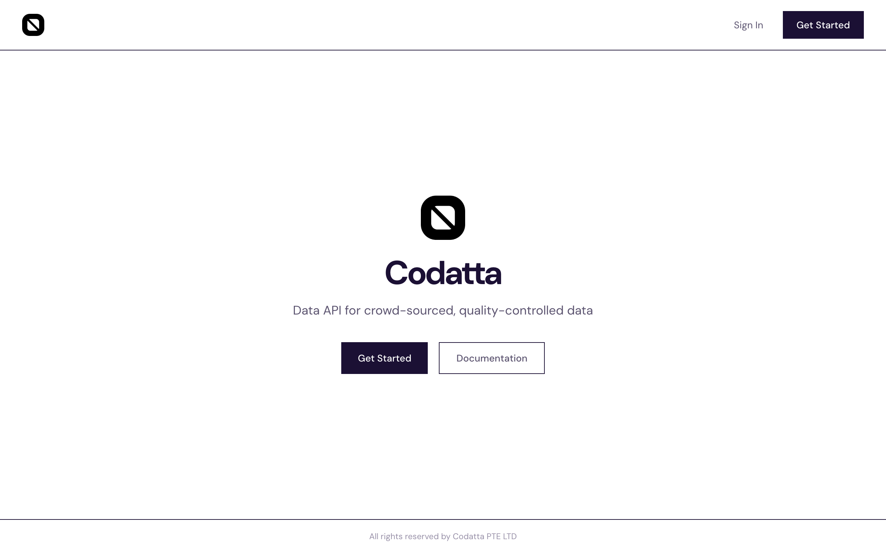

### 1b. Create Your Account

Enter your **company email** and click **Send verification code**. You'll also see OAuth options for GitHub and HuggingFace above the email form.

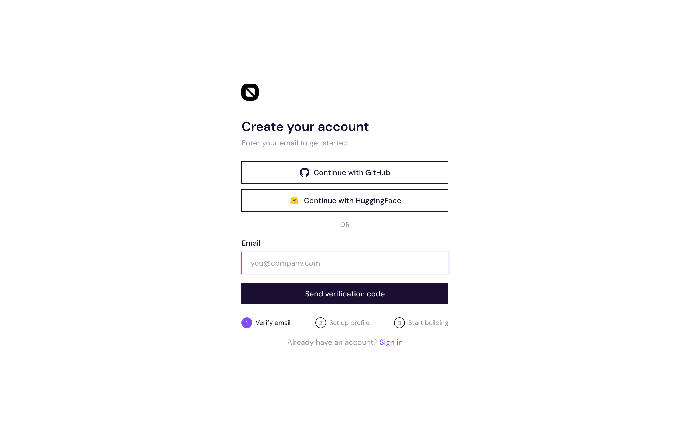

### 1c. Verify and Set Up Profile

1. Check your inbox for a **6-digit OTP** from `noreply@humanbased.ai`
2. Enter the code and click **Verify**
3. Set your **full name** and **password** (requires uppercase, lowercase, digits, and a special character)
4. Click **Create account**

> Already have an account? Use the **Sign in** page instead.
>
> 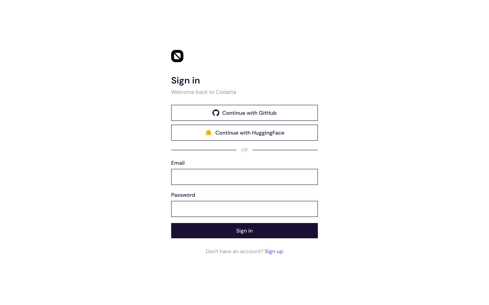

---

## Step 2: Create Your Organization

After account creation, you enter a 3-step organization setup wizard.

### 2a. Organization Info

Fill in your organization details and click **Continue**:

| Field | Description | Example |
|-------|-------------|---------|
| **Organization name** | Your company or team name | Codatta |
| **Slug** | Auto-generated URL identifier | `humanbased.ai/codatta` |
| **Industry** | Select from dropdown | AI / Machine Learning |
| **Size** | Team size range | 1–10 |

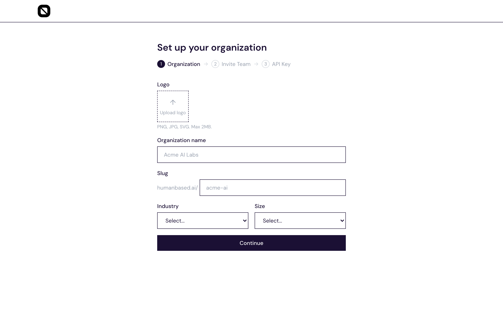

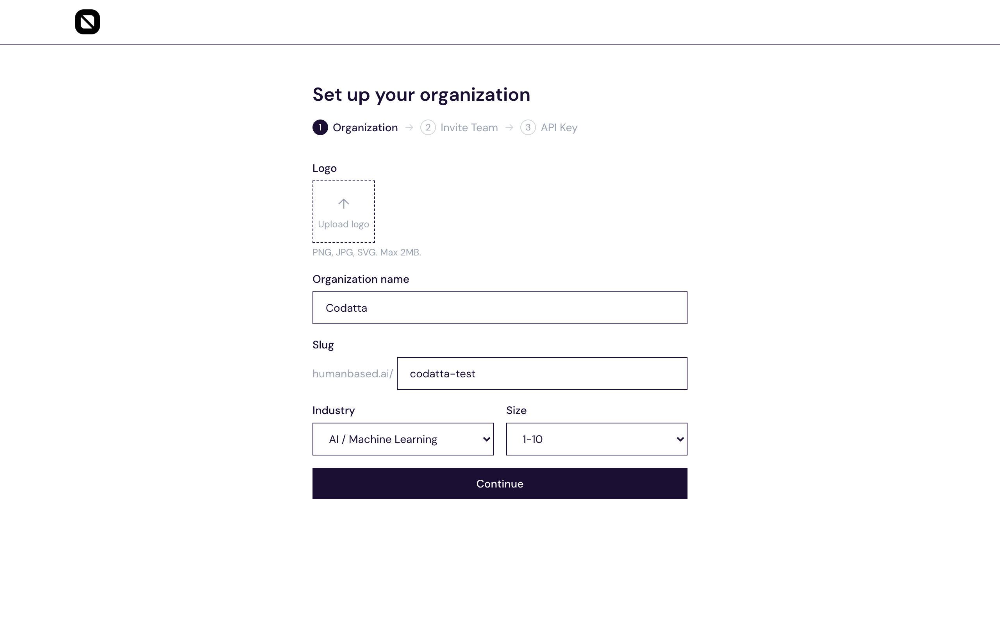

### 2b. Invite Team Members

Optionally invite colleagues by email with role-based access:

| Role | Permissions |
|------|------------|
| **Owner** | Full control — billing, settings, delete org |
| **Admin** | Manage members, API keys, subscriptions |
| **Member** | View data, use existing API keys |

You can skip this and invite members later via **Settings > Team**.

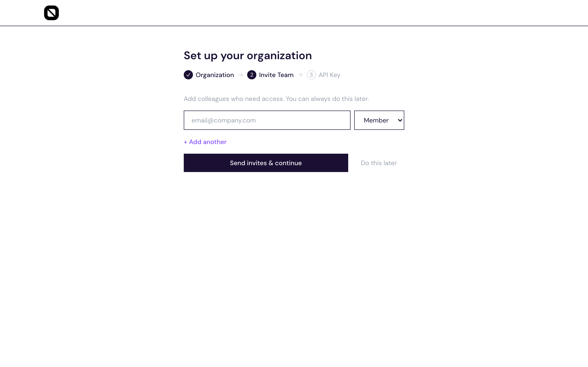

### 2c. Your First API Key

A default API key is generated automatically. **Copy and store it securely** — it is shown only once and cannot be retrieved later.

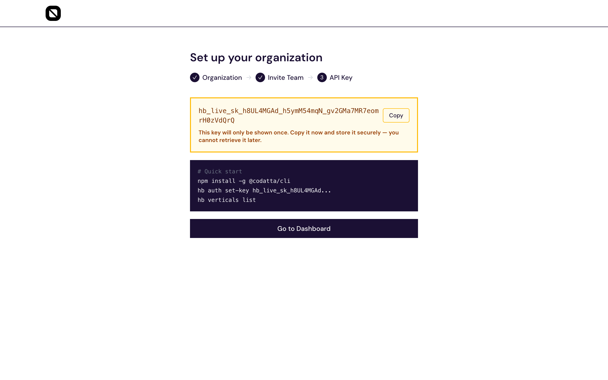

Quick start with the CLI:

```bash
npm install -g @humanbased/cli
hb auth set-key hb_live_sk_...
hb verticals list
```

Click **Go to Dashboard** to continue.

---

## Step 3: Explore the Dashboard

The dashboard is your central hub — it shows your balance, active API keys, subscription status, and a live data stream.

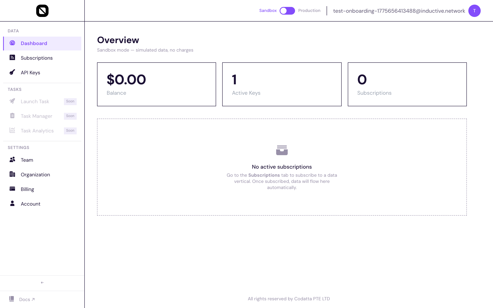

### Sidebar Navigation

| Section | Pages |
|---------|-------|
| **Data** | Dashboard, Subscriptions, API Keys |
| **Tasks** | Launch Task, Task Manager, Task Analytics |
| **Settings** | Team, Organization, Billing, Account |

### Sandbox vs. Production

The toggle at the top of every page controls which environment you're working in:

- **Sandbox** — simulated data, no charges, safe for testing
- **Production** — real crowd-sourced data, metered billing

---

## Step 4: Subscribe to Data Sources

You must subscribe to at least one data vertical before your API key can pull data.

### 4a. Browse Data Verticals

Navigate to **Subscriptions** in the sidebar. Available data sources are displayed as cards with descriptions and pricing.

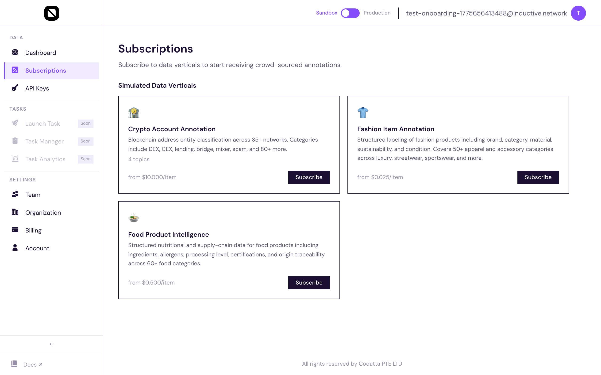

Each data vertical card shows:
- **Name** and description (e.g., Crypto Account Annotation)
- **Categories** (crypto, on-chain, exchange, etc.)
- **Pricing** per item
- **Subscribe** button

### 4b. Subscribe

1. Click **Subscribe** on the data vertical you need
2. Review and accept the **data usage agreement**
3. The subscription activates immediately

Once subscribed, all organization members automatically receive access — no per-user setup needed.

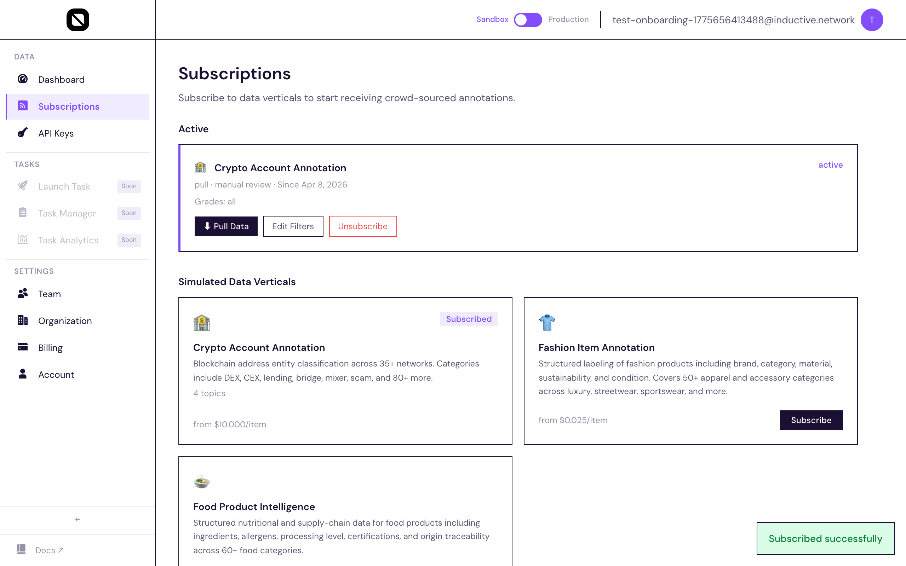

---

## Step 5: Pull Data via API

### Using the Dashboard

1. On your active subscription card, click **Pull Data**
2. The panel shows your subscription ID, status, and a ready-to-use `curl` command

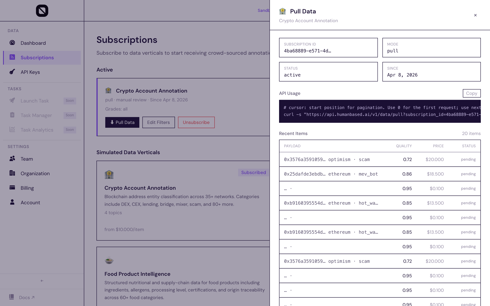

The data table displays recent submissions with:
- **DATA** — annotation content and metadata
- **QUALITY** — confidence score (0–1)
- **GRADE** — quality tier (S, A, B, C, D)
- **PRICE** — per-record cost
- **STATUS** — pending / adopted / disputed

### Using curl

Copy the command from the Pull Data panel, replacing `YOUR_API_KEY`:

```bash
curl -s "https://api.humanbased.ai/v1/live/pull?subscription_id=YOUR_SUBSCRIPTION_ID&cursor=0" \
     -H "Authorization: Bearer YOUR_API_KEY"
```

### Using the CLI

```bash
hb auth set-key hb_live_sk_...
hb data pull --subscription YOUR_SUBSCRIPTION_ID --cursor 0
```

### Pagination

- `cursor=0` starts from the earliest records
- Increment the cursor to fetch newer batches
- Each response includes the next cursor value

---

## Managing API Keys

Create additional keys from the **API Keys** page for different environments or team members.

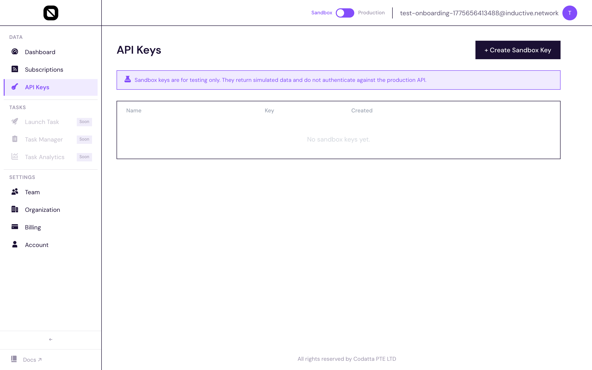

| Property | Details |
|----------|---------|
| **Prefix** | `hb_live_sk_` (production) or `hb_test_sk_` (sandbox) |
| **Naming** | Label keys by use case (e.g., "prod-pipeline", "dev-testing") |
| **Expiry** | Optional — set expiry in days or leave as never-expiring |
| **Revocation** | Revoke any key instantly without affecting others |

---

## Quick Reference

| What | Where |
|------|-------|
| Create account | [developer.humanbased.ai](https://developer.humanbased.ai) → Get Started |
| API documentation | [developer.humanbased.ai](https://developer.humanbased.ai) → Documentation |
| Manage org & team | Dashboard → Settings → Organization / Team |
| Create API keys | Dashboard → API Keys |
| Subscribe to data | Dashboard → Subscriptions |
| Pull data | Active subscription → Pull Data button |
| CLI reference | `npm install -g @humanbased/cli && hb --help` |
| Staging environment | [staging.developer.humanbased.ai](https://staging.developer.humanbased.ai) |

---

## Notes

- **Billing**: API billing and auto-charge is being finalized. Test the data extraction flow first.
- **Subscription sharing**: Once subscribed, all organization members automatically have access.
- **Data review**: Records arrive as "pending" and are auto-adopted after 48 hours unless disputed.

---

## Refreshing Screenshots

To capture fresh screenshots from the staging environment:

```bash
node scripts/capture-codatta-onboarding.mjs
```

Screenshots are saved to `screenshots/codatta-onboarding/`. Override the target with:

```bash
STAGING_BASE_URL=https://staging.developer.humanbased.ai node scripts/capture-codatta-onboarding.mjs
```
